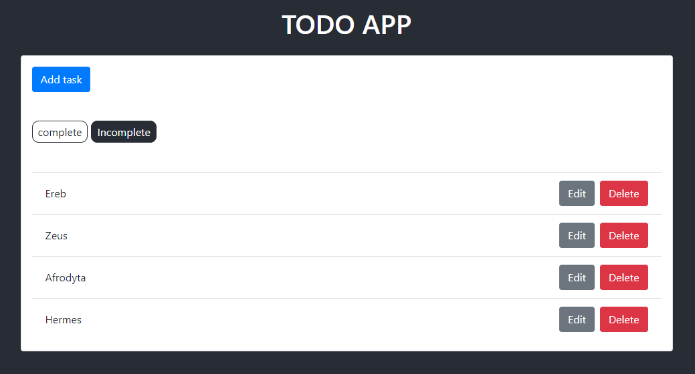
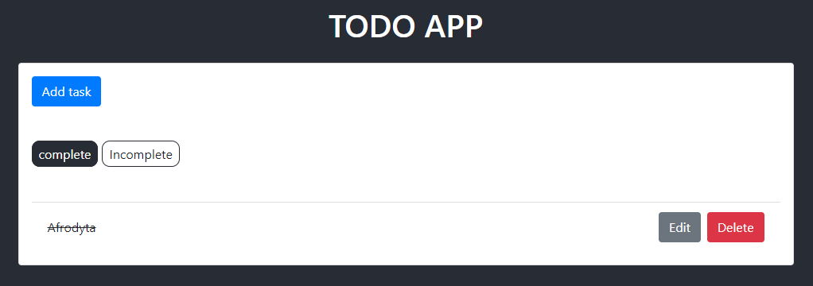

# BJamrowski-aplikacje-internetowe-21666-185ic
## Repozytorium przedmiotu Aplikacje Internetowe

Projekt zakladal przejscie kursu. Opisuje on stworzenie aplikacji, ktora wykorzystuje
Reac.JS do stworzenia front-end aplikacji oraz Django do obslugi back-end.
Aplikacja wykorzystuje prosta baze danych do tworzenia oraz wyswietlania listy dostepnych poradnikow.

Ponizej zaprezentowany jest podglad aplikacji.
Screen przedstawia menu dodwania poradnika.

Ponizszy screen pokazuje liste dostepnych poradnikow.
