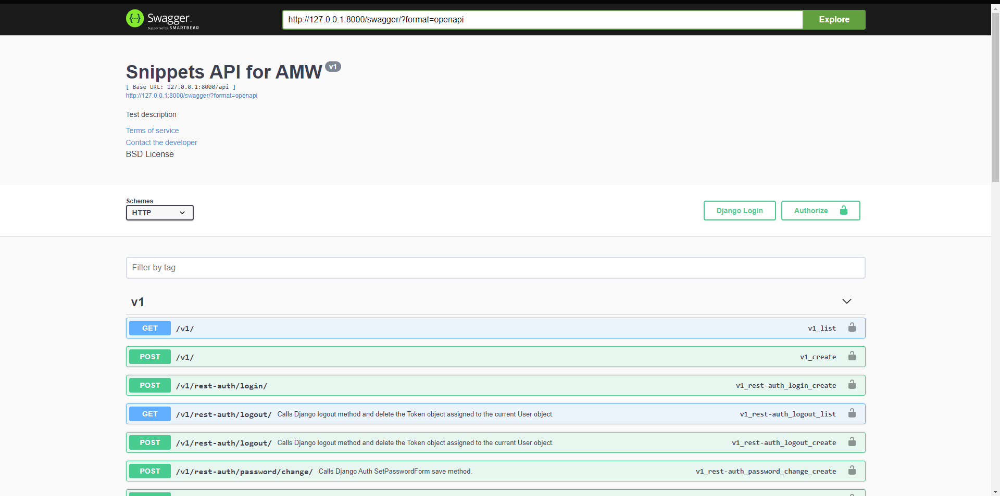

# BJamrowski-projektowanie-aplikacji-21666-185ic
## Repozytorium przedmiotu Aplikacje internetowe

Projekt ten zaklada stworzenie REST API przy wykorzystaniu DRF.

REST to styl architekury oprogramowania, ktory opiera sie
o wczesniej okresolne reugly opisujace jak definiowane sa zasoby,
a takze umozliwia dostep do nich.
API jest zestawem regul, ktore definuja komunikacje pomiedzy systemami
komputerowymi oraz pomiedzy systemem komputerowym a czlowiekiem.
Swagger natomiast to zestaw narzedzi, ktore pomagaja programisom
w projektowniu oraz tworzeniu uslug REST API.
Serializery pozwalaja na przedstawienie zlozonych struktor informacji
w prostszy i latwiejszy w odczycie sposob.

Ponizej widzimy efekt do pierwszych 4 zadan.

