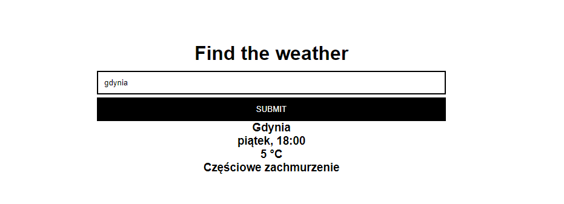

# BJamrowski-projektowanie-aplikacji-21666-185ic
## Repozytorium przedmiotu Aplikacje internetowe

Projekt ten jest rozwinieciem projekty z laboratorium nr 5.

Celem laboratorium bylo zapoznanie sie z web scrapingiem. Pozwala on na zbieranie
danych ze stron internetowych i dalsze ich przetwarzanie badz wyswietlanie. Aby moc tego
dokonac potrzebna nam jest biblioteka Pythona znana pod nazwa Beautiful Soup. Dzieki niej 
mozemy wyciagac dane z plikow HTML oraz XML.
Na laboratoria przygowana zostala aplkacja pobierajaca z witryny google informacje o pogodzie
w wybranym miescie.

Efekt dzialania aplikacji

