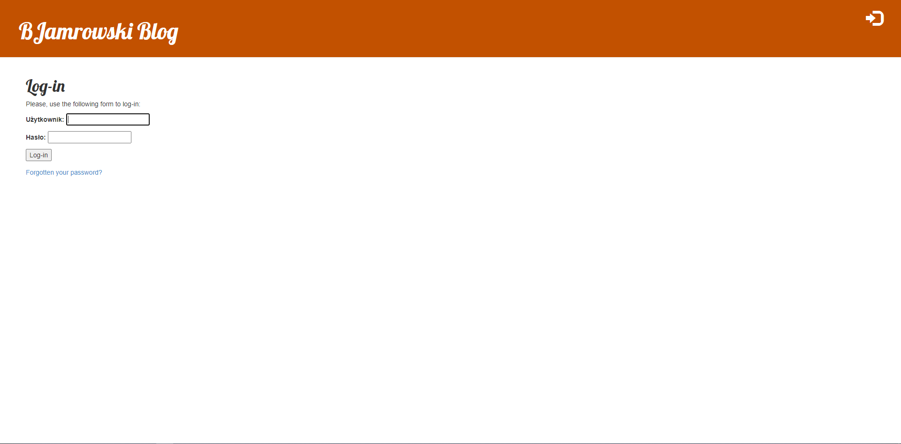
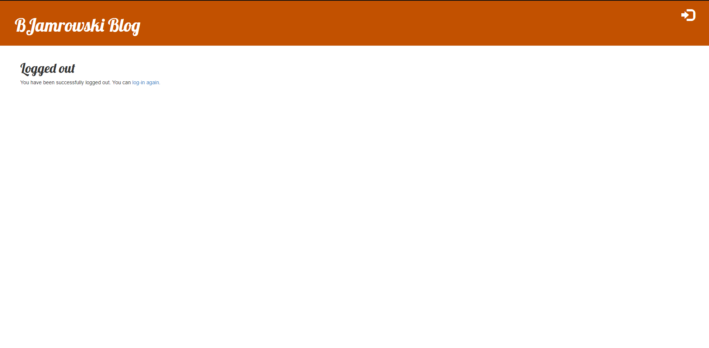
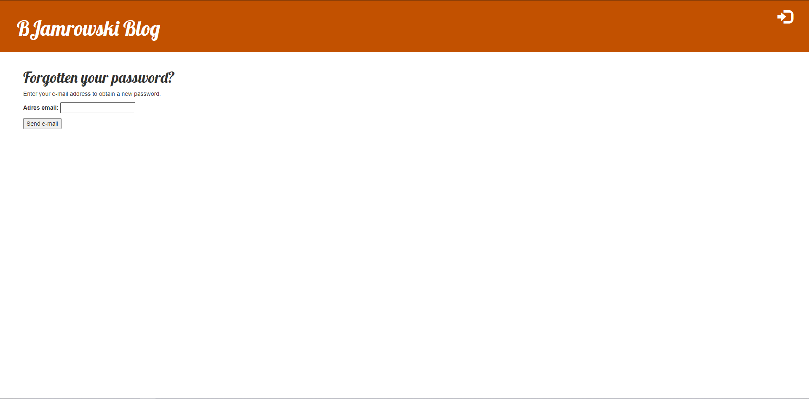
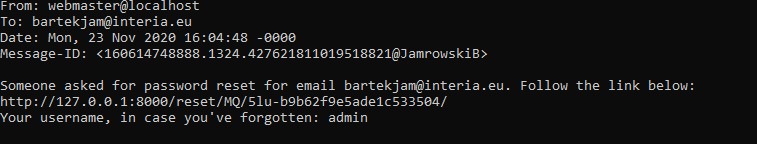
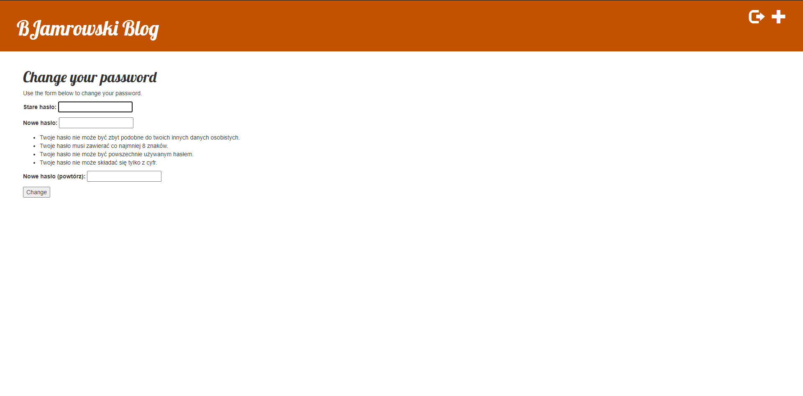

# BJamrowski-aplikacje-internetowe-21666-185ic
## Repozytorium przedmiotu Aplikacje Internetowe

Projekt obejmuje stworzenie widokow umozliwiajacych logowanie, wylogowanie, zmiane oraz reset hasla

Ponizej widzimy menu logowania. Mozemy stad przejsc do widoku resetu hasla.

Przycisk w lewym gornym rogu pozwala na wylogowanie sie.

W ten sposob prezetuje sie menu resetu hasla.

Oto jego efekt w konsoli.

Tutaj widzimy menu zmiany hasla.

