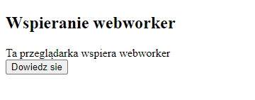

# BJamrowski-aplikacje-internetowe-21666-185ic
## Repozytorium przedmiotu Aplikacje Internetowe

Zadanniem laboratorium bylo stworzenie aplikacji do obslugi czatu. Do budowy czatu zostala wybrana opcja wykorzystujaca socket.io.
Socket.io to biblioteka JS, ktoa pozwala na dwukierunkowa komunikacje miedzy klientem a serwerem

Ponizej widzimy podglad dzialania aplikacji.

Drugim zadaniem bylo stworzenie 2 aplikacji wykorzystujacych webworkery. 
Pierwsza aplikacja sprawdza czy nasza przegladarka obsluguje webworkery.

Druga aplikacja oblicza ciag fibbonaciego. Niestety w tej czesci wystapil problem ze strony przegladarki,
ktorego nie bylem w stanie rozwiazac.
