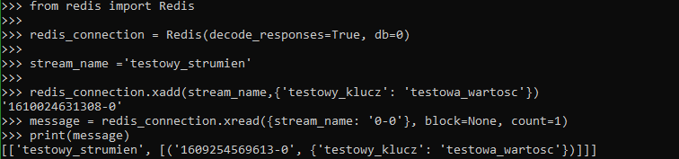

# BJamrowski-aplikacje-internetowe-21666-185ic
## Repozytorium przedmiotu Aplikacje Internetowe

Celem laboratorium byla analiza wspolpracy django wraz z redisem.
Redis to struktora danych, ktora mozna m.in. wykorzystywac jako baze danych.
Jego zaleta jest prostota oraz bardzo szybki dostep do danych. Dane przechowywane sa
w modelu klocz:wartosc, gdzie klucz zawsze jest w formie string.
Zadania

Zadanie 1

Zadanie 2

Zadanie 3

Zadanie 3b

Zadanie 4

Zadanie 5

Zadanie 6

Zadanie 7

Zadanie 8

Zadanie 9

Kolejnym zadaniem bylo przeanalizowanie przykladu wspolpracy
django, redisa oraz celery. Celery pozwala nam na utworzenie
asynchronicznej kolejki zadan.
Aplikacja wykorzstana w tym zadaniu pozwala na wczytanie obrazu.
Obraz ten jest potem przetwarzany i zapisywany w folderze media/images.

Widok aplikacji

