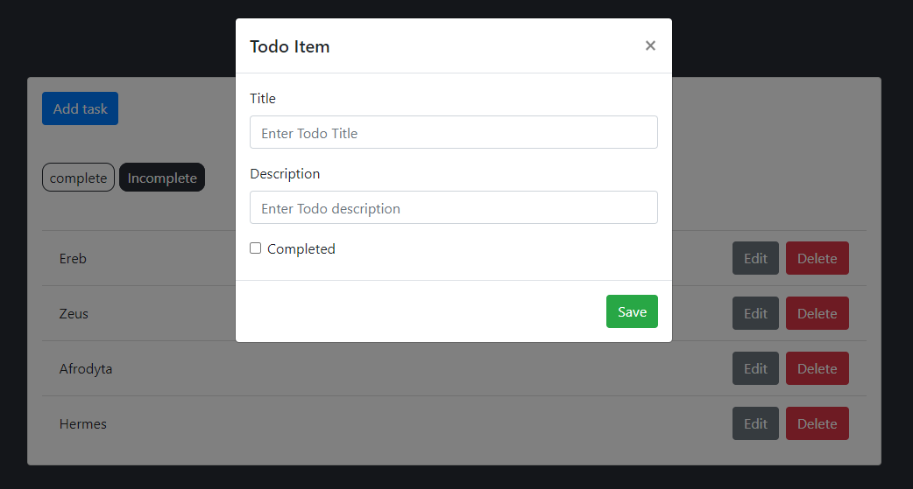

# BJamrowski-aplikacje-internetowe-21666-185ic
## Repozytorium przedmiotu Aplikacje Internetowe

Celem laboratorium bylo stworzenie aplikacji w oparciu o poradnik. Aplikacja ta pozwala na stworzenie listy typu To-Do. Wykorzystuje ona django do obslugi backend oraz Redis.js do obslugi frontend.

Ponizej zaprezentowany jest podglad aplikacji.
Lista nieskonczonych zadan.

Lista zakonczonych zadan.

Menu dodawania zadan zadan.
